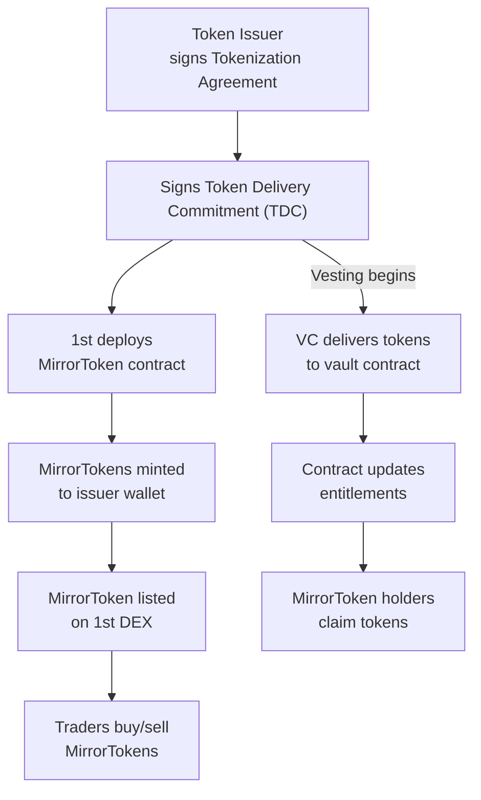

1st turns vesting positions into tradable, enforceable ERC-20 tokens — with real delivery rights, onchain automation, and a native **central limit order book (CLOB)** for execution.

<Columns cols={2}>
  <Card title="Explore the Protocol" icon="network-wired" href="/development" cta="Understand the GTFO architecture">
    How MirrorTokens, Vaults, and Delivery Commitments work together.
  </Card>
  <Card title="How MirrorTokens work" icon="swap" href="/essentials/settings" cta="Explore MirrorToken mechanics">
    Learn how to find, trade, and redeem MirrorTokens for real token delivery.
  </Card>
  <Card title="Token Delivery Commitment (TDC)" icon="signature" href="/essentials/navigation" cta="Read how TDCs work">
    The legal backbone of 1st. Simple, enforceable, and VC-friendly.
  </Card>
  <Card title="CLOB Trading Platform" icon="arrow-right-arrow-left" href="/essentials/navigation" cta="Learn how the CLOB works">
    Trade MirrorTokens through a fully onchain orderbook.
  </Card>
</Columns>

## 🧨 Billions Are Locked. 1st Unlocks Them.

Early-stage token allocations are vesting for years — while the world trades around them.

Funds want to rebalance. Contributors want liquidity. Traders want access.\
Today, they get nothing — or go OTC, off-chain, and into legal gray zones.

**1st creates liquidity with clarity**:

- 📜 Legally binding delivery commitments from VCs
- 🧾 Native CLOB DEX — transparent, orderbook-based price discovery
- 🔄 Tradable ERC-20 forward contracts (MirrorTokens)
- 🔐 Onchain vault settlement, no intermediaries
- ⚖️ Commodity classification, not securities

## 🧬 MirrorTokens: Enforceable, Tradable, Final

Each MirrorToken is:

- A **fractional legal right** to a future token delivery
- Backed by a signed **Token Delivery Commitment (TDC)**
- **Enforceable in court** under commodity forward law
- **Settled automatically** by smart contracts, no admin keys

They’re **not derivatives, not securities, not synthetic exposure** — they’re the **real deal**, wrapped in ERC-20 and ready to trade.

→ [Explore MirrorToken Mechanics](./mirror-token)

## 📄 What Is a TDC?

A **Token Delivery Commitment** is a one-sided legal contract signed by the token issuer.\
It defines what gets delivered, when, and to which vault — no counterparties needed.

It turns locked allocations into something real, transferable, and enforceable.

→ [Read about the TDC Framework](./token-delivery-commitment)

## ⚙️ How It Works

## 🧠 Why This Matters

1st combines:

- 💸 Secondary market liquidity
- ⚖️ Regulatory clarity
- 🔂 Immutable, non-custodial design
- 📈 Price discovery for token unlocks

This isn’t a proxy or a hope.\
It’s a **new asset class** backed by real delivery, real law, and real automation.

## 🎯 Join Early

1st launches soon.\
MirrorToken trading. Real unlocks. No KYC. No intermediaries. Just on-chain performance.

→ [Join the early list](#)

## TL;DR

1st is how the next wave of token markets will work:\
**Enforceable. Liquid. Onchain. No bullshit.**

→ [Dive into the Protocol Overview](./gtfo-protocol)